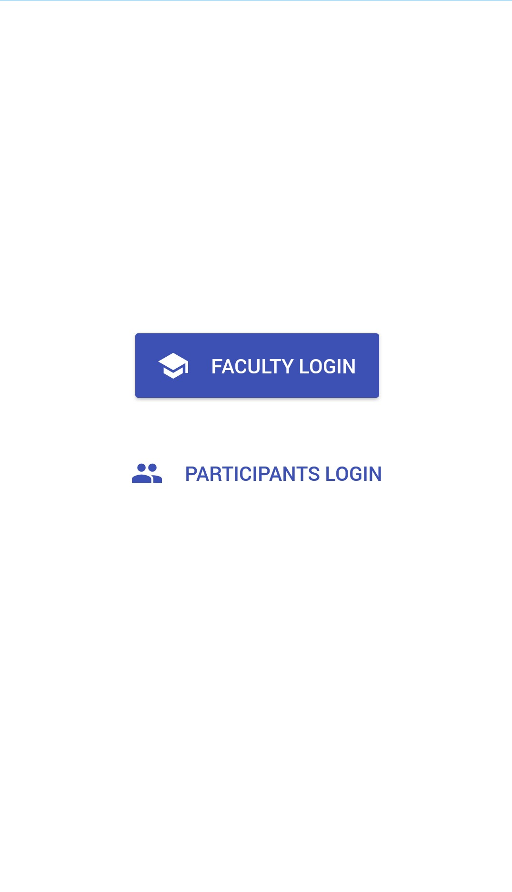
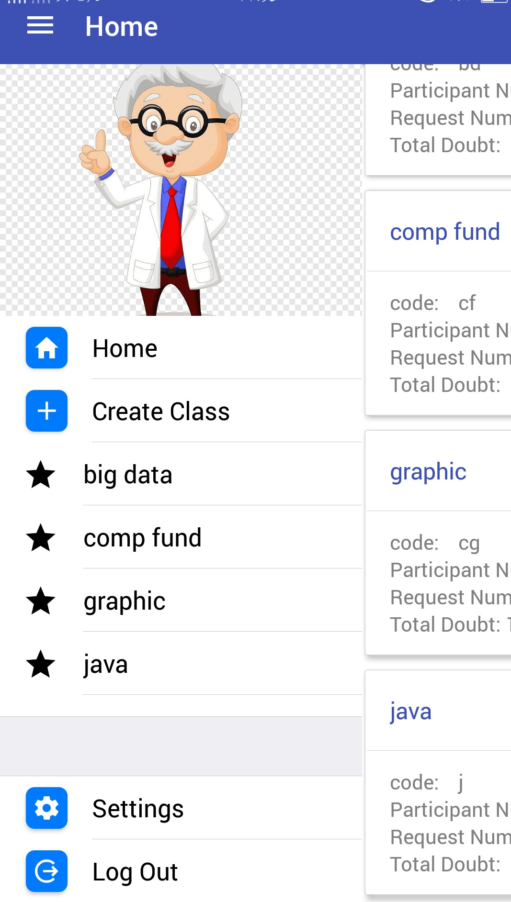
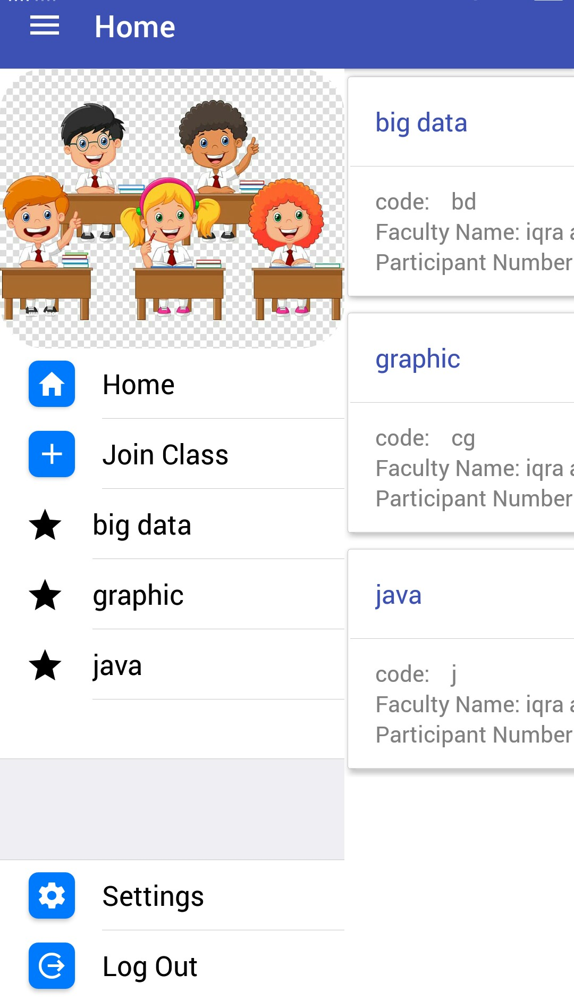
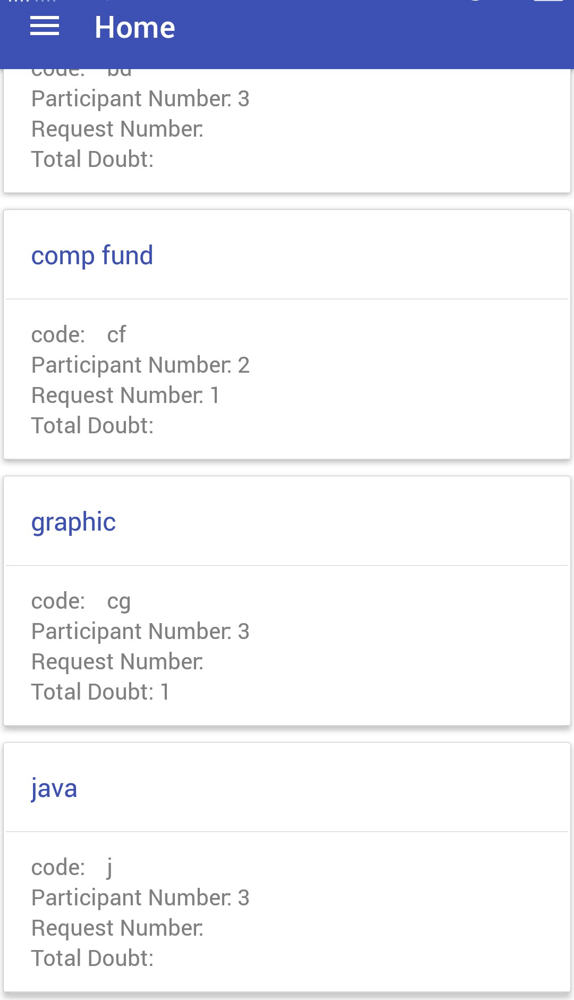
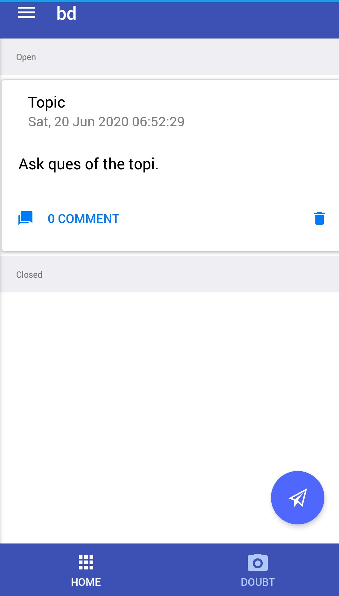
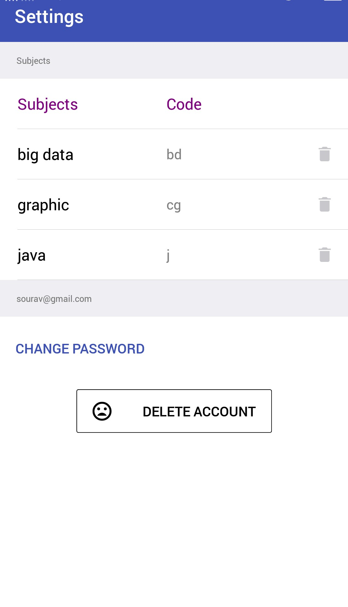

# Doubt-Class-App

***_Images_***

This App help student to ask their doubt with their faculties Anonymously with below condition:

Faculty will share their Subject code and Student have to send request to join.

Their Doubt Can be seen by other participants without disclosing your identity.

Only Faculties can see Your identity with your doubt Question.

Only Faculties and your can Share Views on Your Doubt.

You and Faculties can close your doubt when get Cleared to help other participant to understand.

Currently this App is in beta version.

***

## Link to this App:
https://play.google.com/store/apps/details?id=com.classben10
